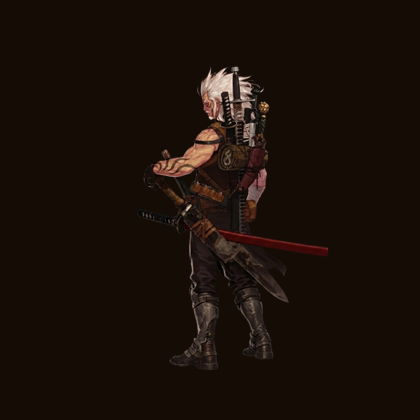
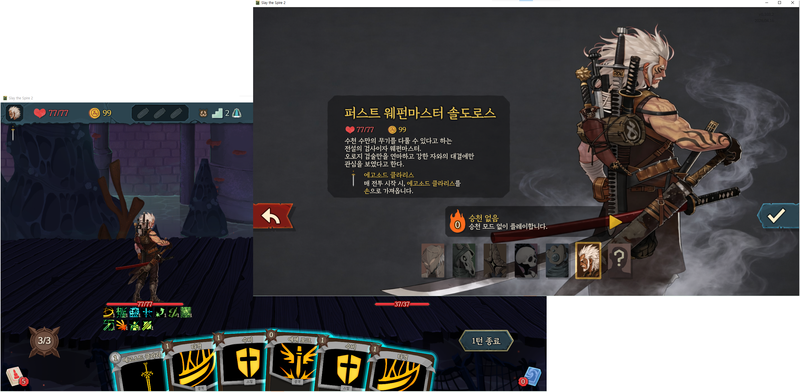

# The First Blade Master Soldoros

`Slay the Spire 2`에 새로운 캐릭터 **솔도로스(Soldoros)** 를 추가하는 모드입니다.






---

## 소개

> *수천 수만의 무기를 다룰 수 있다고 하는 전설의 검사이자 웨펀마스터.*

솔도로스는 에고소드 클라리스라는 특수한 자아검을 중심으로,  
다양한 무기와 류심 자세를 활용해 적을 무력화하는 캐릭터입니다.

- **시작 체력**: 77
- **시작 덱**: 타격 ×4, 수비 ×4, 에쉔 포크, 어퍼 슬래시
- **시작 유물**: 에고소드 클라리스

---

## 핵심 메커니즘

### ⚔️ 에고소드 클라리스 (Egosword Clararis)
전투 시작 시 손으로 들어오는 솔도로스 전용 자아검.  
뽑힐 때마다 모든 적에게 피해를 입히며, 관련 카드·파워와 강력한 시너지를 발휘합니다.

### 🌊 류심 (Flowing Stance)
류심 카드를 사용하면 **류심 승 / 류심 퀘 / 류심 충** 3장의 토큰 공격 카드가 손으로 들어옵니다.  
각 토큰은 0코스트 소멸 카드이며, 무색 카드 시너지·에너지 회수 등 다양한 빌드의 핵심이 됩니다.

### 🎯 취약 (Vulnerable) 활용
솔도로스의 다수 카드가 취약 부여 또는 취약 소비에 특화되어 있습니다.  
취약 상태의 적에게 큰 피해를 주는 **꿰뚫기(Pierce)** 계열 카드로 피해를 극대화하세요.

### 🗡️ 무색 카드 & 유물 시너지
보유한 유물 수에 비례해 강해지는 카드, 무색 카드 사용 시 힘을 획득하는 파워 등  
덱 구성 방향에 따라 다양한 빌드가 가능합니다.

---

## 설치 방법

1. `Slay the Spire 2` 로컬 폴더를 열고, `mods/` 폴더가 없으면 생성합니다.
2. **(필수)** [BaseLib](https://github.com/Alchyr/BaseLib-StS2/releases) 를 다운로드하여 `mods/` 폴더에 압축 해제합니다.
3. 솔도로스 최신 릴리즈를 다운로드하여 `mods/` 폴더에 압축 해제합니다.
4. 게임을 실행하고 모드 선택 화면에서 **The First Blade Master Soldoros** 를 활성화합니다.
5. 즐기세요!

```
Slay the Spire 2/
└── mods/
    ├── BaseLib/         ← 필수 선행 모드
    └── Soldoros/        ← 솔도로스 모드
```

---

## 지원 언어

- 🇰🇷 한국어 (Korean)

---

## 추가/개선 예정 요소

- 캐릭터 전투 애니메이션, 이펙트 추가 (에고소드 오브젝트 추가, ex- 리젠트 군주의 칼날)
- 멀티플레이 지원
- 카드 이미지 개선
- 다국어 지원 (영어 등)
- 밸런스 패치

---

## 크레딧

| 역할 | 이름 |
|------|------|
| 기획 / 개발 | Cardi0 |
| AI 코딩 보조 | Claude Code (Anthropic) |
| 카드 이미지 | AI 생성 |
